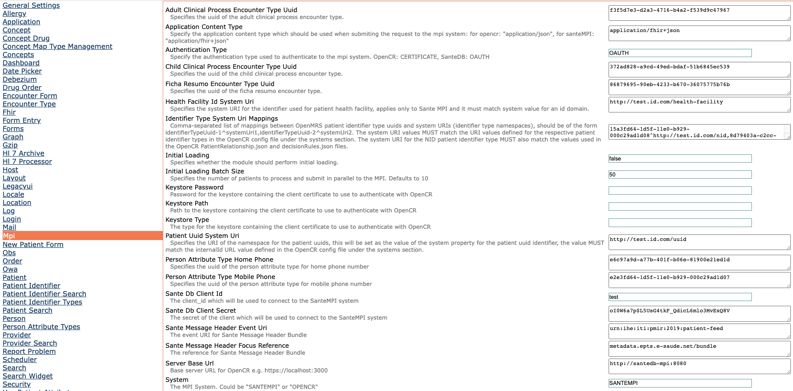

# MPI Integration Module
Provides a mechanism to integrate OpenMRS with OpenCR, the module tracks changes in an OpenMRS database i.e. inserts, 
updates and deletes using the debezium module. This allows the module to be able to create or update a patient's record 
in OpenCR.

## Table of Contents

1. [MPI Integration Technical Overview](#mpi-integration-technical-overview)
2. [Module Technical Overview](#module-technical-overview)
3. [Assumptions](#assumptions)
4. [OpenCR Installation](#opencr-installation)
    1. [Setting Up Certificates](#setting-up-certificates)
    2. [Update Config File](#update-config-file)
    3. [Patient Matching Configuration](#patient-matching-configuration)
5. [Build and Install](#build-and-install)
6. [OpenMRS Configuration](#openmrs-configuration)
    1. [Global properties](#global-properties)
    2. [Logging](#logging)
7. [Initial Loading Of Existing Patients](#initial-loading-of-existing-patients)
8. [Incremental Integration](#incremental-integration)

### MPI Integration Technical Overview


TODO

### Module Technical Overview


TODO

### Assumptions
- You have a patient identifier type used to capture NIDs and that every patient has been assigned an NID
- You have a running instance of OpenCR
- You have created a client certificate for the OpenMRS instance(Central) where the module will be deployed, the 
  certificate will be required to communicate with OpenCR.

### OpenCR Installation
[OpenCR](https://intrahealth.github.io/client-registry/) is the master patient(client registry) implementation we are
using for this integration, the steps below are based on [system admin documentation](https://intrahealth.github.io/client-registry/admin/configuration/) and
[server installation](https://intrahealth.github.io/client-registry/admin/installation_full/).
- Clone the repository below into a directory of choice.
  ```
  git https://github.com/FriendsInGlobalHealth/centralization-docker-setup
  cd centralization-docker-setup/opencr
  ```
- Create a copy of the `docker-compose.prod.yml` file and name it docker-compose.yml
- Edit the `db.env` file and be sure to change at least the passwords and any other values to match your requirements.
- Edit the `application.yml` file and make sure that the spring datasource username and password match those defined in
  the `db.env` file, you can also tweak more field values to match your requirements.

**IMPORTANT**
- For security reasons, **DO NOT** expose the OpenCR instance on the public internet

### Setting Up Certificates
- Generate OpenCR server certificates and a client certificate for OpenMRS instance using [this guide](https://github.com/intrahealth/client-registry/tree/master/server/serverCertificates) 
and please keep note of the locations of the generated files, they will be needed in later steps.
- Copy the generated OpenCR server certificates to the directory containing the `docker-compose.prod.yml` file.   

#### Update Config File
Open the `config_production.json` and make the following changes,
- Change the oauth secret, it is set via the `auth.secret` field, note that we are using dot notation to refer to a 
  nested field i.e. `secret` is a field of the root `auth` field.
- The configuration file has a `systems` field with existing entries where NID is one of them although the URI
  contains an incorrect UUID for the NID patient identifier type from your OpenMRS instance, so you need to set the
  correct UUID in its URI and **DO NOT** change its key name.
- You also need to add entries for all the other OpenMRS identifier types to the systems field for display purposes,
  below is an example entry,

  ```
  "nid": {
      "uri": "urn:uuid:15a3fd64-1d5f-11e0-b929-000c29ad1d08",
      "displayName": "NID"
    }
  ```

  **nid**: Logical key name for the entry

  **uri**: The system URI, it MUST match the associated patient identifier type UUID in OpenMRS prefixed with `urn:uuid:`

  **displayName**: The display label for the identifier type in the OpenCR UI when viewing a patient record

**IMPORTANT:**
- In your new docker-compose.yml file for the elastic search service, it's highly recommended to make sure that volume
  mapped to the elastic data directory is backed up regularly at least once a day, more would even be better if your
  resources can allow.
- Please remember to also regularly backup the MySQL database defined in `docker-compose.yml` which is used by the hapi
  fhir server to store all records pushed to OpenCR.
- It's also highly recommended to backup the debezium offset and history files daily.

#### Patient Matching Configuration
The production docker compose template comes with a built-in patient matching configuration defined in the
`decisionRule.json` file with the following rules,
- **Rule 1**: Any 2 or more patients with the same NID, gender, date of birth, given and family name should be auto
  merged while those the same and any of the other fields don't match are suggested as potential matches.
- **Rule 2**: Any 2 or more patients with the same NID, gender, date of birth, given and family name should be auto
  merged while those with the same gender and birthdate and then any of the nid or given or family fields match are
  suggested as potential matches.

For more details on configuring patient matching in OpenCR refer to the resources below,
- [OpenCR patient matching documentation](https://intrahealth.github.io/client-registry/)
- Inline documentation in the [Deterministic matching template](https://github.com/intrahealth/client-registry/server/config/decisionRulesDeterministicTemplate.json)
- Inline documentation in the [Probabilistic matching template](https://github.com/intrahealth/client-registry/server/config/decisionRulesProbabilisticTemplate.json)

### Build and Install
The MPI module depends on the [debezium module](https://github.com/FriendsInGlobalHealth/openmrs-module-debezium.git) 
therefore you need to first clone, build and install the debezium module as described [here](https://github.com/FriendsInGlobalHealth/openmrs-module-debezium#build-and-install)
Then you can clone, build and install this module as shown below,
```
git clone https://github.com/FriendsInGlobalHealth/openmrs-module-mpi.git
cd openmrs-module-mpi
mvn clean install
```
Take the generated .omod file in the `omod/target` folder and install it in the central OpenMRS instance

### OpenMRS Configuration
Import the OpenCR server certificate into the JVM's trust store for the OpenMRS instance using the following steps,
- Find the OpenCR public key file that you generated under [Setting Up Certificates](#setting-up-certificates) section.
  Alternatively, you can fetch the OpenCR server certificate by running the command below which saves the certificate to 
  a file named `opencr_server.pem` where {OPENCR_HOST} and {OPENCR_PORT} are placeholders for OpenCR host and port,
    ```
    echo "Q" | openssl s_client -connect {OPENCR_HOST}:{OPENCR_PORT} | openssl x509 > opencr_server.pem
    ```
- Run the command below to add the OpenCR server certificate to the JVM's trust store, it assumes JAVA_HOME environment 
  property is set where {PATH_TO_OPENCR_CERT_FILE} is the path to the OpenCR server certificate.
    ```
    keytool -import -alias opencr -keystore $JAVA_HOME/jre/lib/security/cacerts -file {PATH_TO_OPENCR_CERT_FILE}

    ```

#### Global properties
Navigate to the main admin settings page as mentioned below,
- From the main menu, click **Administration**
- Under the **Maintenance** section, click on **Settings**, click on the **Mpi** link in the left panel, and you
  should see a page like the screenshot below, please make sure to read the description of each property carefully.


#### Logging
- Navigate back to the main admin settings page as mentioned below,
- From the main menu, click **Administration**
- Under the **Maintenance** section, click on **Settings**, click on the **Log** link in the left panel, update the 
  value of the **Level**(log.level) global property and append `org.openmrs.module.debezium:info,org.openmrs.module.fgh.mpi:info`
  
Note that the module captures its logs and those of the debezium module and writes them to a special log file located 
in the OpenMRS application data directory at `/path-to-openmrs-app-data-directory/mpi/logs/mpi.log`, this can be very 
useful when debugging any issues that may arise with the module.

### Initial Loading Of Existing Patients
At the time of deploying the MPI integration for an implementation, it's very likely that there is already existing 
patients in the OpenMRS central database that need to be loaded and pushed to OpenCR, to load these patients you need to 
start the central OpenMRS instance by passing a JVM property named `org.openmrs.module.debezium.snapshotOnly`. You 
typically set this property via tomcat's `sevenv.sh` file as shown [here](https://github.com/FriendsInGlobalHealth/centralization-docker-setup/blob/main/openmrs-central/setenv.sh).
**Note** that voided patient's are skipped during initial loading

**IMPORTANT:**

Remember to remove the system property after initial loading completes so that incremental loading takes place after that.

### Incremental Integration
As mentioned in the section above, you can load all existing patients and pushed to OpenCR, to process incremental 
changes to patient records from OpenMRS to OpenCR, you need ensure the system property set during [Initial Loading Of Existing Patients](#initial-loading-of-existing-patients) 
has been removed and should stay this way unless you need to re-run the initial loading.

